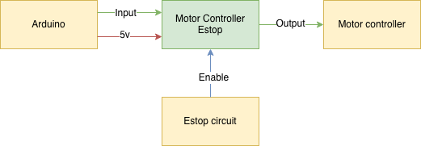

# Motor controller estop overide

The direction of the motor is controlled with using two pins. Enable will override the inputs and output low when enable is low. 

The schematic has enough outputs for two motors.

## Components
4x [irf530n mosfets](https://www.mouser.com/ProductDetail/Infineon-Technologies/IRF530NPBF?qs=sGAEpiMZZMvsw8vHdI9FuuyVnNvMCBqh)
12x 10k resistors
4x 1k resistors
2x 4 port JST connector
1x 3 port JST connector
## Images

## Designers

- Tyler Julian - Designer - [TylerJulian](https://github.com/tylerjulian)

## Built With

- KiCAD - Used to create schematics and pcbs. 

## Errata
* revision 1's PCBs had the incorrect footprint for the jst connectors and the drain and source of the mosfets were switched.
